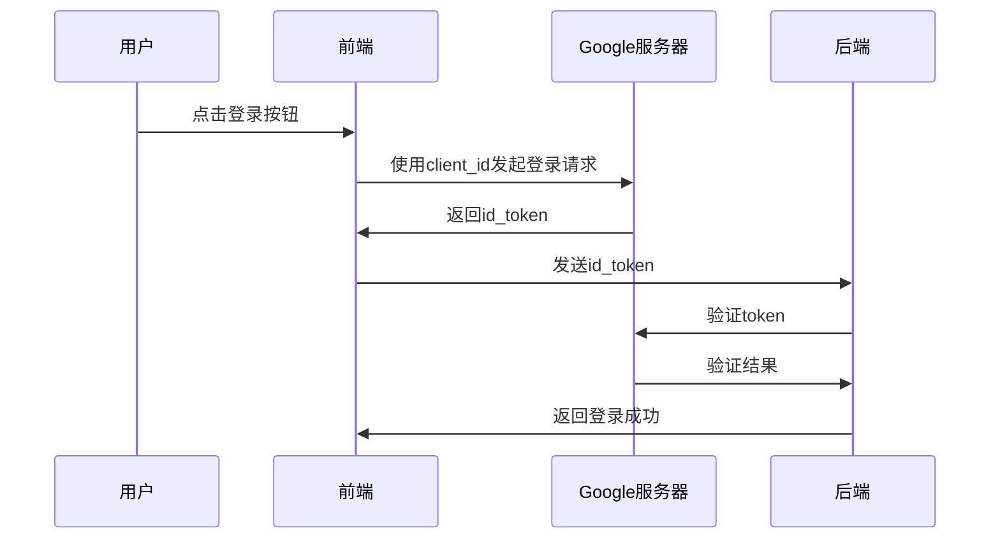
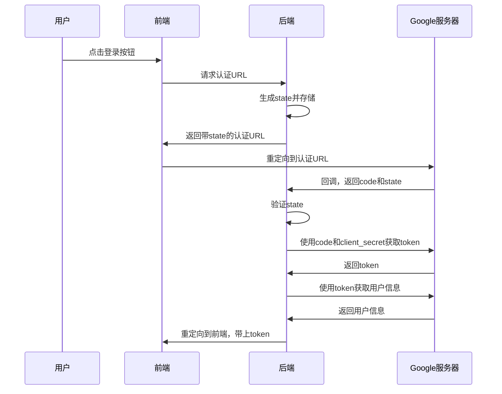

**登录（Sign-in）=**  **把“我是某人”告诉系统，并换取一段后续访问能用的“通行证”**

## 身份认证、授权、鉴权

| 过程 | 典型问题           |  |
| ------ | -------------------- | -- |
| **认证 Authentication**     | “你是谁？”       |  |
| **授权 Authorization**     | “允许你做什么？” |  |
| **鉴权（资源访问时）**     | “带的凭证对吗？” |  |

**每次点接口时都要验凭证**——这是**鉴权 / 访问控制**，是前两步落地到具体请求的瞬时检查


## 1. 早期 Web 的“密码共享”困境

2005-2007 年，很多热门服务（Twitter、Flickr、Ma.gnolia 等）开放 HTTP API，可是要用 API 的第三方应用只能让用户 **填自己的主站账号密码**。这叫  **“Password Anti-Pattern”** ：

- 用户被迫把主账号密码交给陌生网站或桌面程序。
- 一旦泄露，攻击者不仅能看数据，还能改密码、删内容。
- 用户想撤回权限，只能改密码，体验极差。

Twitter 工程师 **Blaine Cook**、Open Web 推动者 **Chris Messina** 等人因此在 2006-2007 年组织讨论，催生了第一版 **OAuth 1.0（2007-12）** ——目标很朴素：

> *让网站 A 可以代表用户安全地访问网站 B 的 API，而用户永远不用把密码给网站 A*。

## OAuth 的“曲线救国”

> **思路：把“密码”换成“令牌”，再把发令牌这件事交回给原站自己做。**

四个角色与一次授权的“分工”：

| 角色                 | 类比           | 责任                 |
| ---------------------- | ---------------- | ---------------------- |
| Resource Owner       | 用户本人       | 决定是否授权         |
| Client               | 第三方应用     | 想拿到令牌干活       |
| Authorization Server | 原站的授权窗口 | 向用户确认后签发令牌 |
| Resource Server      | 原站的 API     | 看令牌放行或拒绝     |

### 2.1 授权码（Authorization Code）为何存在

- 浏览器里先拿到的 **只是一次性“兑换券”** （Code）。
- 只有拿着 **兑换券 + Client Secret／PKCE** 的后端才能换到真正的 **Access Token**。
- 因此 **令牌永远不暴露在前端**，即便 XSS 也只能偷到一次性 Code。

## OAuth **不是登录协议**

OAuth 关心的是“能不能访问 API”，并没有规定“谁在登录”。如果 App 只想确认用户身份，还得自己再去查 “你是谁”。这让开发者经常**混用 Access Token 当登录凭证**，导致实现千姿百态。

为了解决“缺失身份层”的尴尬，业界在 2014 正式发布 **OpenID Connect（OIDC）** ：

- 明确引入 **ID Token（JWT）** ：把“用户是谁、何时登录、由谁认证”写进签名令牌。
- 格式统一，可在后端一句代码验证签名即可信任身份


## Google 登录是怎样把这两层拼在一起的？

1. **用户被重定向到 Google**（OAuth `/authorize`）。
2. Google 让 TA 登账号、2FA，并展示“是否允许 XXX 读取你的邮箱”。
3. 用户同意 → Google 带 **Code** 和随机 **state** 返回你的 `redirect_uri`。
4. 你的后端携 **Code + Secret + (PKCE)**  调 `/token`：

    - 得到 **Access Token**（以后调 Gmail、Calendar…）
    - 得到 **ID Token**（这就是“登录凭证”）
5. 你的系统验证 ID Token 签名，读出 `sub`(全局唯一 ID)、`email`、`picture` 等，正式建立本地会话。

于是——

| 目的         | 用到的标准      | 谱系                            |
| -------------- | ----------------- | --------------------------------- |
| 不再给密码   | OAuth 2.0       | 解决 2006-2007 “密码共享”痛点 |
| 知道谁在登录 | OIDC (ID Token) | 2014 增补的身份层               |


## One Tap vs. Oauth授权码

| 方案 | 技术路径                                              | 取舍                                       |
| ------ | ------------------------------------------------------- | -------------------------------------------- |
| **One Tap / 前端直拿 ID Token**     | Google JS SDK → 浏览器收到 ID Token → POST 后端验证 | 体验极简；client\_id 暴露，难加业务拦截 |
| **OAuth 授权码**     | 浏览器→后端→Google（拿 Code）→后端换 Token         | 步骤多一跳；Secret 不外泄，后端完全可控    |


## 一、One Tap 前端直接获取ID Token, 对应master分支

### 1. 流程概述

原始登录流程采用 Google Identity Services (One Tap) 方式，前端直接与 Google 服务器交互获取 ID Token，然后发送给后端验证。

### 2. 详细步骤

#### 2.1 前端实现

```html
<!-- 引入Google Identity Services -->
<script src="https://accounts.google.com/gsi/client" async defer></script>

<!-- 初始化Google登录按钮 -->
<div id="g_id_onload"
    data-client_id="YOUR_CLIENT_ID"
    data-callback="handleCredentialResponse"
    data-auto_prompt="false">
</div>
<div class="g_id_signin" data-type="standard"></div>

<!-- 处理登录回调 -->
<script>
function handleCredentialResponse(response) {
    // 发送ID Token到后端验证
    fetch('/auth/google-login', {
        method: 'POST',
        headers: {
            'Content-Type': 'application/json'
        },
        body: JSON.stringify({
            token: response.credential
        })
    })
    .then(res => res.json())
    .then(data => {
        if (data.code === 200) {
            // 登录成功，保存token
            localStorage.setItem('token', data.data.tokenValue);
        }
    });
}
</script>
```

#### 2.2 后端实现

```java
@RestController
@RequestMapping("/auth")
public class AuthController {
    @Value("${google.client.id}")
    private String googleClientId;

    @PostMapping("/google-login")
    public SaResult googleLogin(@RequestBody Map<String, String> body) {
        String idToken = body.get("token");
        GoogleIdToken.Payload payload = verifyGoogleToken(idToken);

        if (payload == null) {
            return SaResult.error("Invalid Google token");
        }

        // 提取用户信息
        String email = payload.getEmail();
        String name = (String) payload.get("name");
        String googleId = payload.getSubject();

        // 查找或创建用户
        User user = userService.findOrCreateByEmail(email, name, googleId);

        // 登录并生成token
        StpUtil.login(user.getId());

        return SaResult.ok("登录成功").setData(StpUtil.getTokenInfo());
    }

    private GoogleIdToken.Payload verifyGoogleToken(String idTokenString) {
        try {
            GoogleIdTokenVerifier verifier = new GoogleIdTokenVerifier.Builder(
                    new NetHttpTransport(), new GsonFactory())
                    .setAudience(Collections.singletonList(googleClientId))
                    .build();

            GoogleIdToken idToken = verifier.verify(idTokenString);
            return idToken != null ? idToken.getPayload() : null;
        } catch (Exception e) {
            e.printStackTrace();
            return null;
        }
    }
}
```

### 3. 交互流程



## 二、原始流程的缺陷

### 1. 安全性问题

- Client ID 直接暴露在前端代码中
- 任何人都可以通过浏览器开发者工具查看和复制
- 可能导致未授权的应用使用这个 Client ID

### 2. 配置管理问题

- Client ID 同时存在于前端和后端配置中
- 需要维护多处配置，容易造成不一致
- 修改配置时需要同时更新多个地方

### 3. 流程控制问题

- 前端直接与 Google 服务器通信
- 后端无法控制登录流程
- 难以实现额外的安全验证或业务逻辑

## 三、OAuth 2.0 授权码流程

### 1. 流程概述

改进后的流程采用标准的 OAuth 2.0 授权码流程，所有与 Google 的交互都通过后端进行，提高了安全性和可控性。

### 2. 详细步骤

#### 2.1 配置管理

需要在google console中 已获授权的重定向 URI 进行配置回调url

```yaml
google:
  auth:
    client:
      id: ${GOOGLE_CLIENT_ID:your-client-id}
      secret: ${GOOGLE_CLIENT_SECRET:your-client-secret}
    redirect:
      uri: ${BACKEND_URL:http://localhost:8080}/auth/google-callback
    frontend:
      url: ${FRONTEND_URL:http://localhost:8080}
```

#### 2.2 前端实现

```html
<button id="google-login-btn">使用Google账号登录</button>

<script>
googleLoginBtn.addEventListener('click', async () => {
    try {
        // 从后端获取认证URL
        const response = await fetch('/auth/google-auth-url');
        const data = await response.json();
        
        if (data.code === 200) {
            // 重定向到Google登录页面
            window.location.href = data.data;
        }
    } catch (err) {
        console.error('Error:', err);
    }
});

// 处理回调
window.addEventListener('load', () => {
    const urlParams = new URLSearchParams(window.location.search);
    const token = urlParams.get('token');
    if (token) {
        localStorage.setItem('token', token);
        // 清除URL参数
        window.history.replaceState({}, document.title, window.location.pathname);
    }
});
</script>
```

#### 2.3 后端实现

```java
@RestController
@RequestMapping("/auth")
public class AuthController {
    @Autowired
    private GoogleOAuthService googleOAuthService;

    @GetMapping("/google-auth-url")
    public SaResult getGoogleAuthUrl(HttpSession session) {
        // 生成state
        String state = UUID.randomUUID().toString();
        // 存储state到session
        session.setAttribute("oauth_state", state);
        
        // 获取认证URL
        String authUrl = googleOAuthService.getAuthUrl(state);
        return SaResult.ok().setData(authUrl);
    }

    @GetMapping("/google-callback")
    public void handleGoogleCallback(
            @RequestParam String code,
            @RequestParam String state,
            HttpSession session,
            HttpServletResponse response) throws IOException {
        
        // 验证state
        String savedState = (String) session.getAttribute("oauth_state");
        if (savedState == null || !savedState.equals(state)) {
            response.sendRedirect(config.getFrontend().getUrl() + "?error=invalid_state");
            return;
        }
        
        try {
            // 验证token并获取用户信息
            GoogleIdToken.Payload payload = googleOAuthService.verifyToken(code);
            
            // 处理用户登录
            User user = userService.findOrCreateByEmail(
                payload.getEmail(),
                (String) payload.get("name"),
                payload.getSubject()
            );

            // 登录
            StpUtil.login(user.getId());

            // 重定向到前端
            response.sendRedirect(config.getFrontend().getUrl() + "?token=" + StpUtil.getTokenValue());
        } catch (Exception e) {
            response.sendRedirect(config.getFrontend().getUrl() + "?error=" + e.getMessage());
        }
    }
}
```

### 3. 交互流程



### 4. 安全机制

#### 4.1 State参数

- 用于防止CSRF攻击
- 每个认证请求都有唯一的state
- 验证后立即删除，防止重放攻击

#### 4.2 配置安全

- 敏感配置（client_secret）只在后端使用
- 避免配置重复和不一致


| 字段 | 在 OAuth 2.0 规范里的角色                                                | 典型形式 | 是否必须保密                               |
| ------ | -------------------------------------------------------------------------- | ---------- | -------------------------------------------- |
| **client_id**     | “公共标识符 (public identifier)”——用来告诉授权服务器“我是哪个应用” | `1234567890-abc.apps.googleusercontent.com`         | 否。可以安全地出现在浏览器、日志或移动包里 |
| **client_secret**     | “客户端密码 (client password)”——当客户端向授权服务器**自证身份**时使用           | `GOCSPX-XaB7D4qSgk2kHkP6yxZt0IRuvdf`         | 是。只能存放在**可信环境**（服务器、加密配置）         |

| 场景           | 只拿`client_id`能做什么？                                               | 需要`client_secret`才能做什么？                                    |
| ---------------- | -------------------------------------------------------------- | ----------------------------------------------------- |
| **发起授权请求**（浏览器跳到`/authorize`） | ✔︎ 可以。`client_id`告诉 Google 你是谁，以便页面上显示“**某某应用**希望访问...” | —                                                  |
| **交换 Authorization Code**`/token`endpoint       | ✘*不行*（除非属于“公共客户端 + PKCE”流程）                      | ✔︎**需要**。服务器用`client_secret`+ code 换 Access / ID / Refresh Token |
| **刷新 Access Token**               | ✘                                                           | ✔︎ 凭`refresh_token + client_secret`                                             |
| **撤销 / 反注册令牌**               | ✘                                                           | ✔︎ 许多 AS 要求 client 先认证                     |
| **身份验证方式 (client authentication)**               | ➜ 相当于“匿名”或用 PKCE 代替                              | ➜ “带密码进门”模式，属于**Confidential Client**                         |